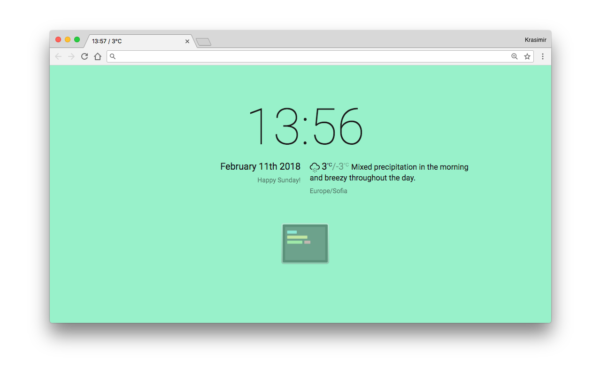
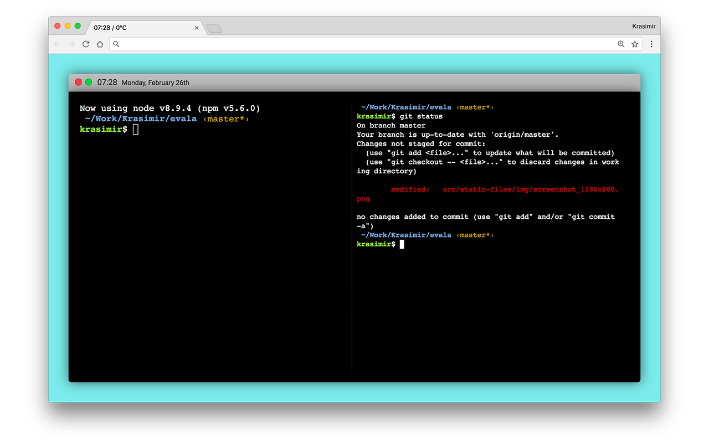

# Evala

A new tab extension that shows the time, the weather and brings your terminal in the browser.




## How to use it

### Install the browser extension

* [Chrome](https://chrome.google.com/webstore/detail/evala/bmaojegjknddmkhfbkhfijcblmamgino)

### Install and run Evala server

The Evala server acts as a bridge between the browser and the actual terminal.

```
> npm install evala -g
> evala --shell=$SHELL
```

Make sure that you pass the `--shell` argument or Evala will use the default `bash` (or `cmd.exe` under Windows) shell.
